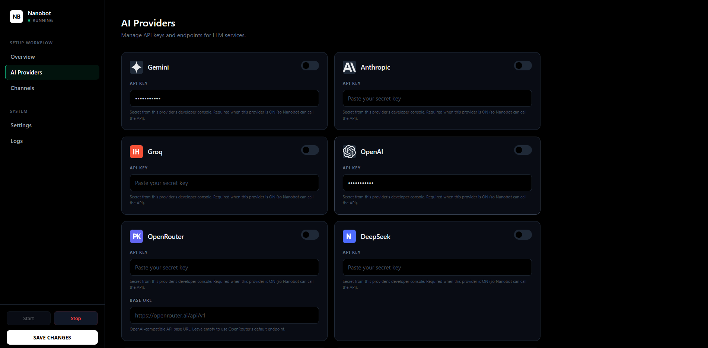
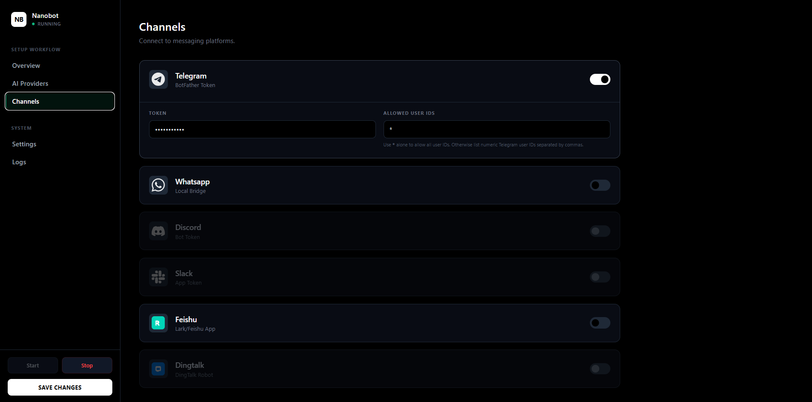
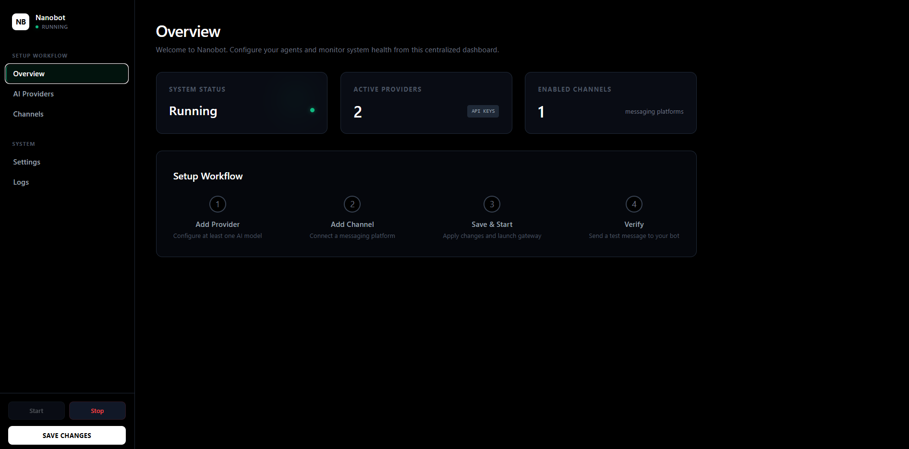
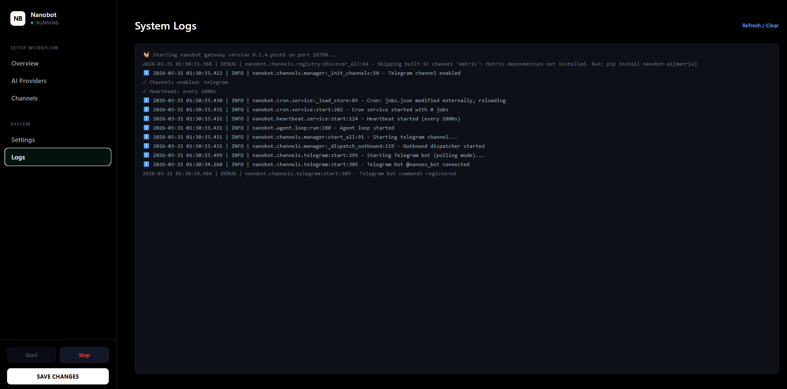

# Deploy and Host nanobot on Railway

Nanobot is a lightweight AI gateway and orchestration layer that routes requests across multiple LLM providers and messaging channels such as Telegram. It provides a centralized dashboard to manage models, API keys, and runtime configuration, making it ideal for building scalable AI-powered backends without managing multiple integrations manually.

## About Hosting nanobot

Hosting nanobot involves deploying a containerized gateway service along with its admin dashboard. The system acts as a middleware between your applications (or chat channels) and multiple AI providers such as OpenAI, Gemini, or Groq.

Instead of hardcoding API integrations, nanobot allows dynamic configuration via a web dashboard, with persistent storage for settings. On Railway, deployment becomes straightforward: you run a Docker container, attach a persistent volume, and configure environment variables. Railway handles networking, scaling, and uptime, while nanobot handles AI routing, logging, and orchestration.

## Common Use Cases

* Multi-LLM Gateway (OpenAI, Gemini, Groq switching & fallback)
* Telegram / Messaging AI Bot backend (no need to build from scratch)
* Internal AI API Hub (centralized AI access for multiple services)
* Experimentation layer for prompt routing and model benchmarking

## Dependencies for nanobot Hosting

* Docker (containerized deployment)
* Railway account (for hosting and infrastructure)
* Persistent storage (/data volume for config & logs)

### Deployment Dependencies

* Upstream Nanobot: [https://github.com/HKUDS/nanobot](https://github.com/HKUDS/nanobot)
* Railway Platform: [https://railway.com](https://railway.com)
* Telegram Bot (optional): [https://core.telegram.org/bots](https://core.telegram.org/bots)

### Implementation Details

#### Architecture Overview

Nanobot runs as a single container that exposes:

* Admin Dashboard (Basic Auth protected)
* Gateway API for routing requests
* Background worker loop (for message processing)

Data persistence:

* All configuration and state stored in `/data` (must use Railway Volume)

#### Step 1 — Deploy on Railway

* Deploy this template on Railway
* Railway builds using the `Dockerfile` (via `railway.toml`)
* A public URL will be automatically assigned
* Strongly recommended:

  * Attach a Volume mounted to `/data` (critical for persistence)

#### Step 2 — Admin Credentials

Set environment variables:

* `ADMIN_USERNAME` → dashboard login username
* `ADMIN_PASSWORD` → dashboard login password

Notes:
* For production: ALWAYS set explicitly

#### Step 3 — Configure LLM Providers

1. Open your Railway public URL
2. Login using Basic Auth
3. Go to **AI Providers tab**
4. Add API Keys:

   * OpenAI
   * Groq
   * Gemini
5. Select models (or custom model ID)
6. Set default provider (toggle)
7. Save configuration (stored in `/data`)

    

#### Step 4 — Configure Messaging Channels (Telegram Example)

1. Go to **Channels tab**
2. Enable Telegram
3. Paste bot token from BotFather
4. Set allowed users:

   * `*` → allow all users
   * or specific user IDs (comma-separated)

    

You can also configure:

* WhatsApp bridge
* Feishu / other integrations

#### Step 5 — Run and Test Gateway

* Go to **Overview / Settings**
* Start or restart the gateway
* Check logs for errors
* Send test message to your bot

    

If no response:

* Check API keys
* Check provider selection
* Check logs
  
  

#### Key Endpoints

* `GET /` → Admin dashboard (Basic Auth)
* `GET /health` → Healthcheck (Railway)
* `GET /api/config` → Read config (masked)
* `PUT /api/config` → Save config
* `GET /api/status` → Gateway status
* `GET /api/logs` → Logs
* `POST /api/gateway/start` → Start gateway
* `POST /api/gateway/stop` → Stop gateway
* `POST /api/gateway/restart` → Restart gateway

## Why Deploy nanobot on Railway?

Railway is a singular platform to deploy your infrastructure stack. Railway will host your infrastructure so you don't have to deal with configuration, while allowing you to vertically and horizontally scale it.

By deploying nanobot on Railway, you are one step closer to supporting a complete full-stack application with minimal burden. Host your servers, databases, AI agents, and more on Railway.